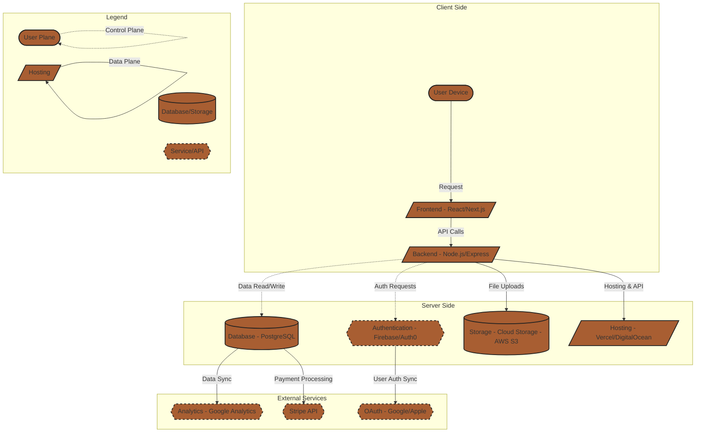

```mermaid

graph TD;
    subgraph Client Side
        A([User Device]) -->|Request| B[/Frontend - React/Next.js/]
        B -->|API Calls| C[/Backend - Node.js/Express/]
    end

    subgraph Server Side
        C -.->|Auth Requests| D{{Authentication - Firebase/Auth0}}
        C -.->|Data Read/Write| E[(Database - PostgreSQL)]
        C -->|File Uploads| F[(Storage - Cloud Storage - AWS S3)]
        C -->|Hosting & API| G[/Hosting - Vercel/DigitalOcean/]
    end

    subgraph External Services
        E -->|Data Sync| H{{Analytics - Google Analytics}}
        E -->|Payment Processing| I{{Stripe API}}
        D -->|User Auth Sync| J{{OAuth - Google/Apple}}
    end

    subgraph Legend
        K([Oval]) -.->|Control Plane| K([User Plane])
        L[/Parallelogram/] -->|Data Plane| L[/Hosting/]
        M[(Database/Storage)]
        N{{Service/API}}
    end

    style A fill:#a85e32,stroke:#212121,stroke-width:2px;
    style B fill:#a85e32,stroke:#212121,stroke-width:2px;
    style C fill:#a85e32,stroke:#212121,stroke-width:2px;
    style D fill:#a85e32,stroke:#212121,stroke-width:2px,stroke-dasharray:5 5;
    style E fill:#a85e32,stroke:#212121,stroke-width:2px;
    style F fill:#a85e32,stroke:#212121,stroke-width:2px;
    style G fill:#a85e32,stroke:#212121,stroke-width:2px;
    style H fill:#a85e32,stroke:#212121,stroke-width:2px,stroke-dasharray:5 5;
    style I fill:#a85e32,stroke:#212121,stroke-width:2px,stroke-dasharray:5 5;
    style J fill:#a85e32,stroke:#212121,stroke-width:2px,stroke-dasharray:5 5;
    style K fill:#a85e32,stroke:#212121,stroke-width:2px;
    style L fill:#a85e32,stroke:#212121,stroke-width:2px;
    style M fill:#a85e32,stroke:#212121,stroke-width:2px;
    style N fill:#a85e32, stroke:#212121,stroke-width:2px,stroke-dasharray:5 5;

```
