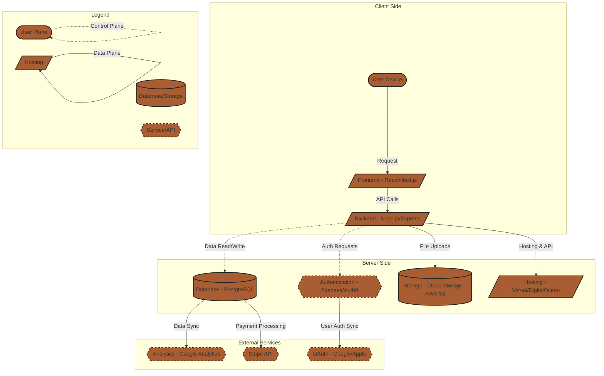

# Stingr Minimum Lovable Product (MLP) and System Design

## 1. Minimum Lovable Product (MLP) Overview
The **Minimum Lovable Product (MLP)** for Stingr is designed to provide an intuitive and efficient way for clients to discover tattoo artists and for artists to manage their bookings. Our focus is on three indispensable features that will make the platform both useful and engaging for our users.

### Feature 1: Swipe-Based Artist Discovery
**Why it’s indispensable:**
- Provides an intuitive, visual method for clients to browse tattoo artists based on style, location, and availability.
- Reduces the time spent searching for an artist through traditional means like Instagram or word-of-mouth.
- Helps independent artists gain exposure without relying solely on social media algorithms.

### Feature 2: Instant Booking & Consultation Requests
**Why it’s indispensable:**
- Allows clients to request consultations and book appointments directly within the app, eliminating the need for lengthy email chains and social media messaging.
- Streamlines communication between clients and artists, reducing scheduling conflicts and no-shows.
- Ensures artists receive only serious inquiries, improving their ability to manage appointments efficiently.

### Feature 3: Guided Consultation Messaging
**Why it’s indispensable:**
- Allows artists to get the information they need right away before talking with the client, this saves time and gives the artist a foundation to iterate off of
- Ensures clients come into a consultation knowing what they want, through guided questions they can better explain their idea
- Helps streamline the consultation and reduce misunderstandings between artists and clients

---

## 2. System Block Diagram
The following block diagram illustrates the major components of the Stingr platform, including the **control plane** (control signals) and **data plane** (flow signals).

### System Architecture Overview
**Major Components:**
- **Client Side (Frontend)**: Where users interact with the platform.
- **Server Side (Backend)**: Manages authentication, bookings, and data processing.
- **External Services**: Third-party APIs for authentication, analytics, and payments.

**Block Diagram Description:**
- **Control Plane**: Manages user authentication, profile setup, and artist-client interactions.
- **Data Plane**: Handles image uploads, bookings, transactions, and communication.

---

## 3. Engineering Block Diagram

