# Stingr Minimum Lovable Product (MLP) and System Design

## 1. Minimum Lovable Product (MLP) Overview
The **Minimum Lovable Product (MLP)** for Stingr is designed to provide an intuitive and efficient way for clients to discover tattoo artists and for artists to manage their bookings. Our focus is on three indispensable features that will make the platform both useful and engaging for our users.

### Feature 1: Swipe-Based Artist Discovery
**Why it’s indispensable:**
- Provides an intuitive, visual method for clients to browse tattoo artists based on style, location, and availability.
- Reduces the time spent searching for an artist through traditional means like Instagram or word-of-mouth.
- Helps independent artists gain exposure without relying solely on social media algorithms.

### Feature 2: Instant Booking & Consultation Requests
**Why it’s indispensable:**
- Allows clients to request consultations and book appointments directly within the app, eliminating the need for lengthy email chains and social media messaging.
- Streamlines communication between clients and artists, reducing scheduling conflicts and no-shows.
- Ensures artists receive only serious inquiries, improving their ability to manage appointments efficiently.

### Feature 3: Fair & Affordable Artist Platform
**Why it’s indispensable:**
- Unlike existing platforms that charge high commission fees, Stingr will provide transparent, fair pricing for artists.
- Offers flexible subscription plans or low commission rates to support independent and emerging artists.
- Encourages more tattoo artists to join the platform by providing an artist-friendly environment.

---

## 2. System Block Diagram
The following block diagram illustrates the major components of the Stingr platform, including the **control plane** (control signals) and **data plane** (flow signals).

### System Architecture Overview
**Major Components:**
- **Client Side (Frontend)**: Where users interact with the platform.
- **Server Side (Backend)**: Manages authentication, bookings, and data processing.
- **External Services**: Third-party APIs for authentication, analytics, and payments.

**Block Diagram Description:**
- **Control Plane**: Manages user authentication, profile setup, and artist-client interactions.
- **Data Plane**: Handles image uploads, bookings, transactions, and communication.

---

## 3. Engineering Block Diagram

```mermaid
graph TD;
    subgraph Client Side
        A1([User Device]) -->|Request| B[/Frontend - React/Next.js/]
        B -->|API Calls| C[/Backend - Node.js/Express/]
    end

    subgraph Server Side
        C -.->|Auth Requests| D{{Authentication - Firebase/Auth0}}
        C -.->|Data Read/Write| E[(Database - PostgreSQL)]
        C -->|File Uploads| F[(Storage - Cloud Storage - AWS S3)]
        C -->|Hosting & API| G[/Hosting - Vercel/DigitalOcean/]
    end

    subgraph External Services
        E -->|Data Sync| H{{Analytics - Google Analytics}}
        E -->|Payment Processing| I{{Stripe API}}
        D -->|User Auth Sync| J{{OAuth - Google/Apple}}
    end

    style A1 fill:#FFC107,stroke:#212121,stroke-width:2px;
    style B fill:#E0A800,stroke:#212121,stroke-width:2px;
    style C fill:#00796B,stroke:#212121,stroke-width:2px;
    style D fill:#212121,stroke:#212121,stroke-width:2px,stroke-dasharray:5 5;
    style E fill:#00796B,stroke:#212121,stroke-width:3px;
    style F fill:#00796B,stroke:#212121,stroke-width:3px;
    style G fill:#E0A800,stroke:#212121,stroke-width:2px;
    style H fill:#212121,stroke:#212121,stroke-width:2px,stroke-dasharray:5 5;
    style I fill:#26A69A,stroke:#212121,stroke-width:2px,stroke-dasharray:5 5;
    style J fill:#26A69A,stroke:#212121,stroke-width:2px,stroke-dasharray:5 5;
```

---

## 4. Legend
- **Client Side**: Represents user interaction with the Stingr platform.
  - **User Device**: The mobile or desktop device accessing the web app (**oval shape**).
  - **Frontend (React/Next.js)**: The client-side interface users interact with (**parallelogram**).
  - **Backend (Node.js/Express)**: Handles API requests and business logic (**parallelogram**).

- **Server Side**: Core backend services responsible for authentication, data management, and hosting.
  - **Authentication (Firebase/Auth0)**: Manages user sign-in and security (**dashed border** to indicate control signals).
  - **Database (PostgreSQL)**: Stores user profiles, bookings, and artist data (**cylinder shape for storage**).
  - **Storage (AWS S3)**: Stores images and portfolio data (**cylinder shape for storage**).
  - **Hosting (Vercel/DigitalOcean)**: Hosts the application and backend APIs (**parallelogram for external hosting**).

- **External Services**: Third-party integrations for analytics, payments, and authentication.
  - **Analytics (Google Analytics)**: Tracks user behavior for optimization (**dashed border for control signals**).
  - **Payment Processing (Stripe API)**: Handles secure payments (**dashed border for control signals**).
  - **OAuth (Google/Apple)**: Allows social sign-in options (**dashed border for control signals**).

- **Control Plane**: Handles authentication requests and user interactions (**dashed arrows**).
- **Data Plane**: Manages image uploads, database transactions, and payments (**solid arrows**).

---

## 5. Submission Format
To submit this document as a **PDF**, follow these steps:
1. Copy this content into **Google Docs or Microsoft Word**.
2. Adjust formatting for readability (headings, spacing, diagrams).
3. Export as **PDF** (`File > Download > PDF`).
4. Submit the PDF to the required platform.

This document follows **professional technical writing best practices** by maintaining a structured format, clear descriptions, and well-labeled diagrams.

